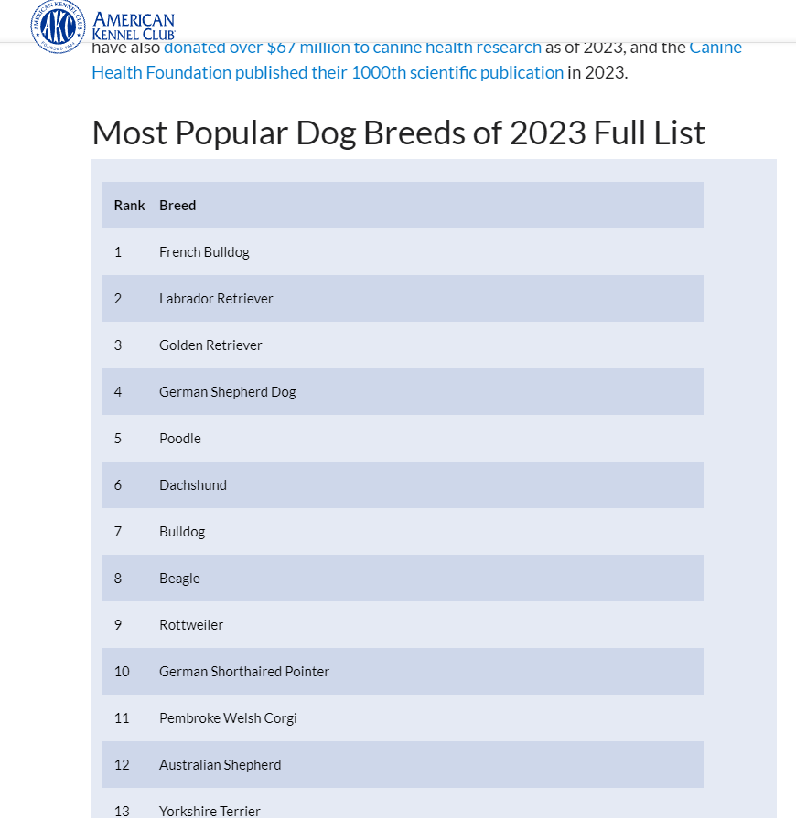
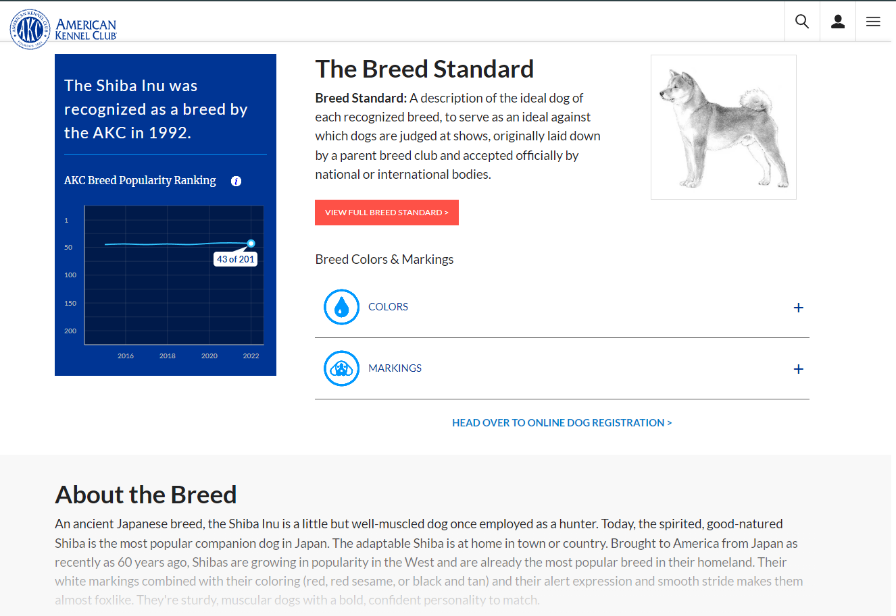

## 데이터 탐색 보고서    
#### 크롤링한 사이트에 대한 분석 정보
    - AKC 2023 견종 랭킹
      - https://www.akc.org/expert-advice/news/most-popular-dog-breeds-2023/
    - AKC 견종 정보 검색
      - https://www.akc.org/dog-breeds/{}

#### 크롤링 한 각 사이트에 대한 정보
    - American Kennel Association 은 개와 개의 반려동물로 키우는 사람들의 권리를 보장하기 위한 비영리 단체이다. 
#### 크롤링하기 위해서 분석한 내용들 작성
    - 견종 랭킹
#### 크롤링한 페이지 캡쳐
 
#### selector등의 특징
    - 테이블로 작성되어 있는 셀렉터
    - 이미지 셀렉터
    - Read more이 가리지만, 큰 이슈 없이 텍스트 모두 선택할 수 있는 셀렉터
#### 어려웠던 점
    - Selenium 구동 시간이 오래 걸린다. 
    - 테이블 형식 selector 찾기가 어려웠다. 
    - 깃허브 레포 연동 시 각자 겪는 문제가 달랐다.
    - 크롤링한 견종 이름과 검색되는 견종 이름에 대한 차이가 발생했다.
    - 데이터 제공처의 데이터 신뢰도 이슈가 존재했다.(오타 등)

#### 하면서 어려웠던 점과 어떻게 해결했는지
    - Selenium은 짧은 테스트를 여러번 진행하여 시간을 절약하였다. 
    - 테이블 형식 selector는 기존 네이버 주식 크롤링 수업이 도움이 됬다. 
    - 깃허브 레포는 2시간의 구글링을 통해 해결하였다. 
    - 동일한 사이트 내에서 크롤링 및 검색하여 견종 이름에 대한 격차를 해소했고, 검색창 이슈로 인해 url에 견종 이름을 대입하여 검색하는 방식으로 변경하여 해결했다.
    - Exception 및 continue 처리를 통해 데이터 정제가 덜 된 객체는 스킵했다.

#### 프로젝트 구현 방식
    - 견종 및 랭킹 happy_puppy.csv 파일 생성 시 AKC 사이트에서 테이블 형식의 CSS selector 선택. Requests를 통해 요청을 날리고 BeautifulSoup으로 html을 str으로 변환.  이를 Pandas를 사용하여 csv 테이블 형식으로 저장.
    - happy_puppy.csv에서 파일을 읽어 견종 이름을 가져오고, Selenium을 통해 url 대입 검색하여 정보 획득.
#### 데이터 셋
    - 견종, 견종 랭킹, 견종 이미지 url, 견종 상세 설명(csv)
#### 크롤링한 데이터
    - 견종, 견종 랭킹, 견종 이미지 url, 견종 이미지, 견종 상세 설명
